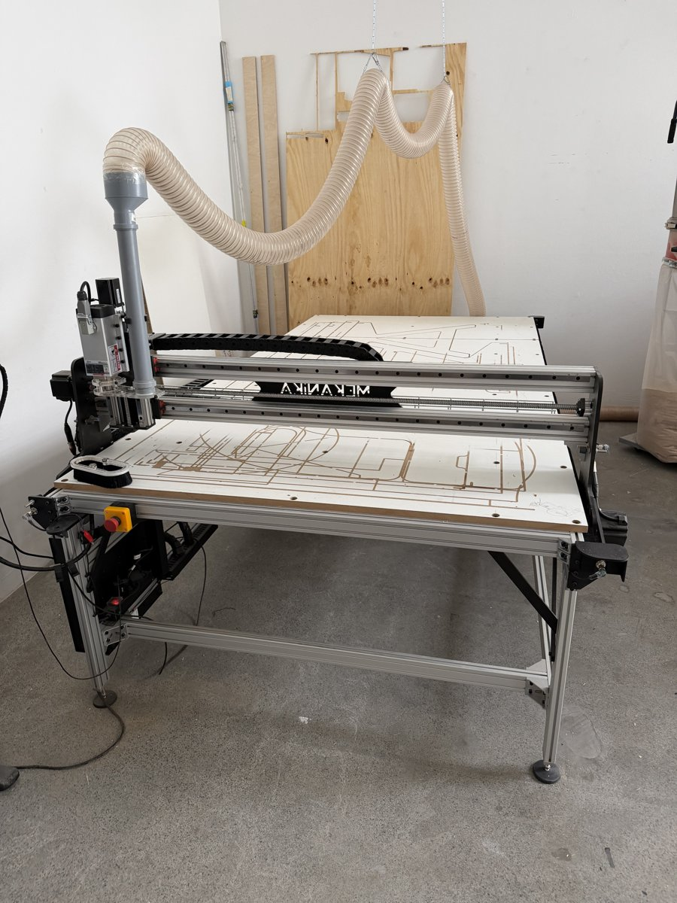
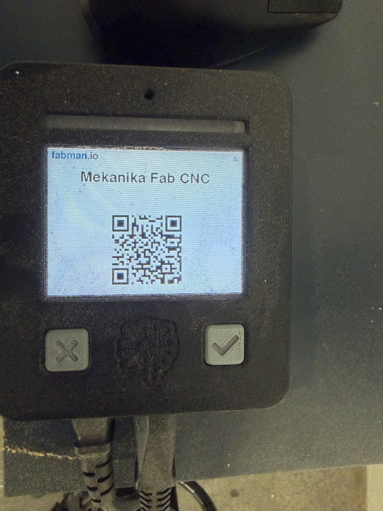
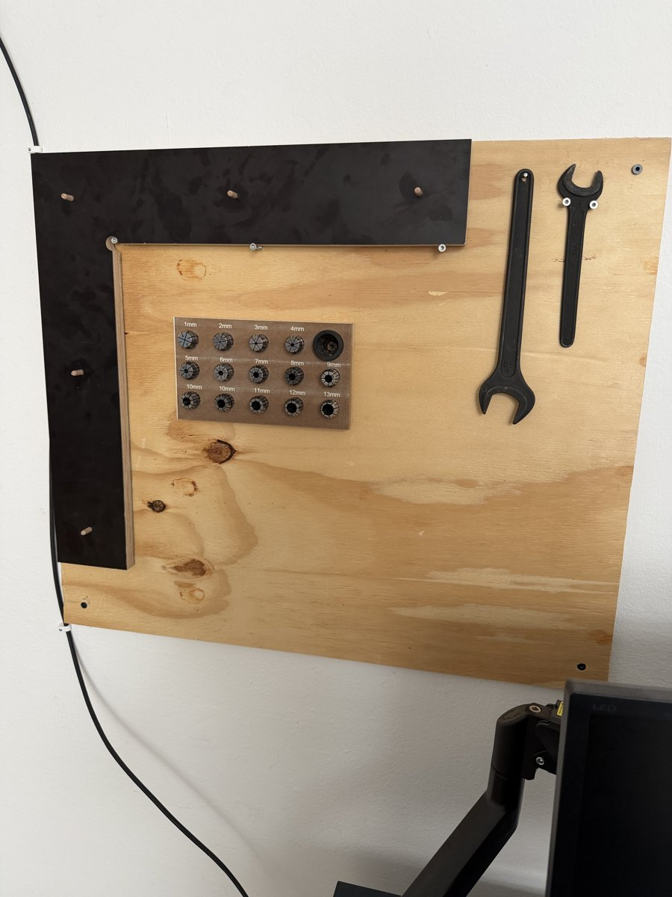
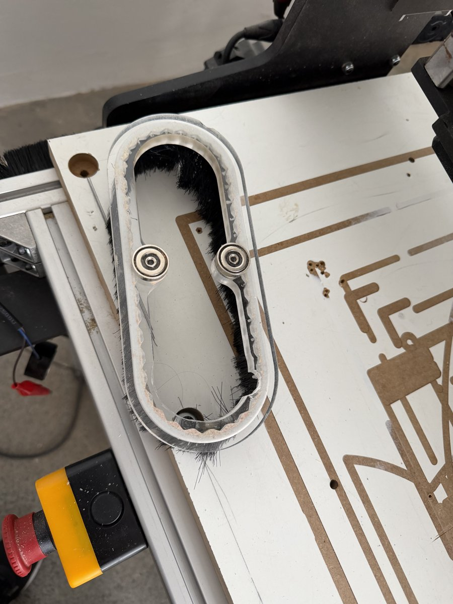
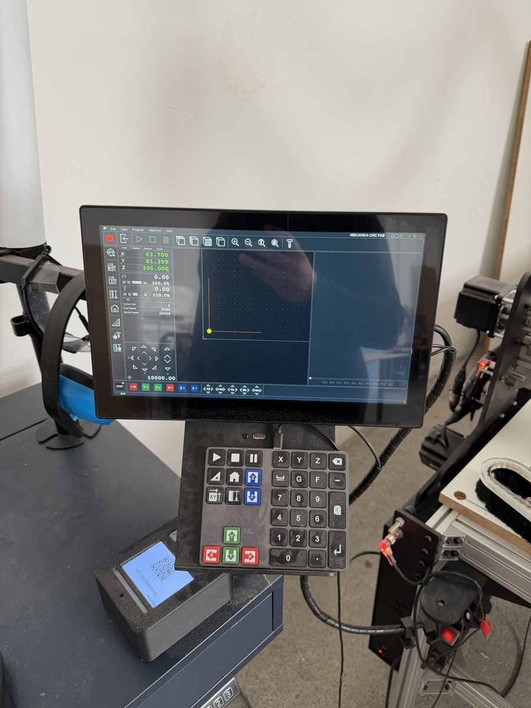
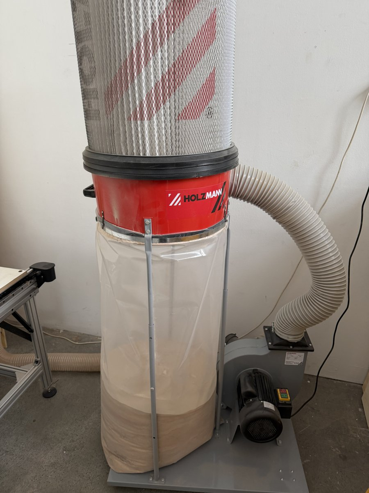
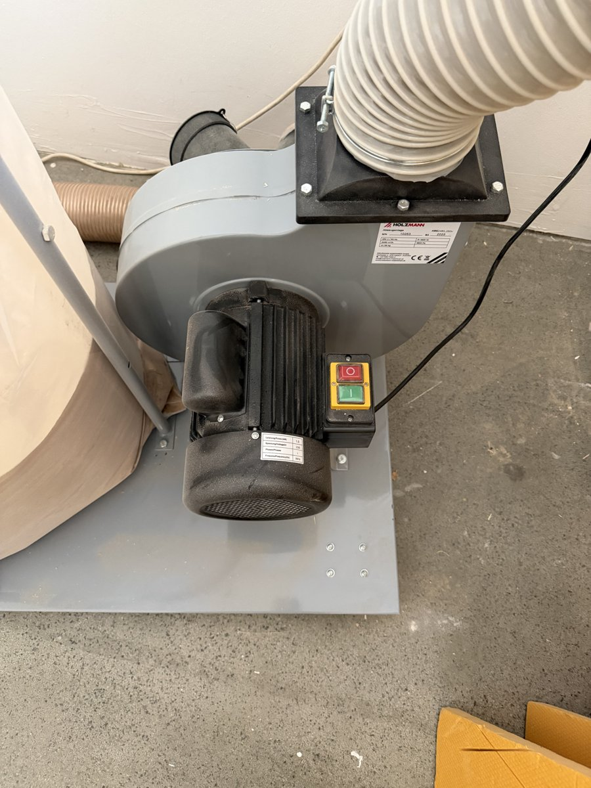

# CNC

The CNC area is for flat-panel milling, drilling, and routing — cutting parts out of sheet material (MDF, plywood, etc.) from a digital file, rather than by hand. Use it instead of the woodworking tools when you need repeatable precision, complex/curved shapes, or to nest many parts efficiently out of one board.

## Machines

### Mekanika Fab CNC

**Location:** _[where in the shop]_
**Training required:** Yes — hands-on sign-off with a shop lead covering homing/squaring, tool changes, zeroing, and safety before independent use. You check in on the machine via the **Fabman** terminal mounted on it (tap/scan your member QR code) before you can start the spindle.

**Overview**
The Fab is Mekanika's large-format CNC router — a gantry-style machine that mills, drills, and contour-cuts flat panel material (MDF, plywood, composites) using swappable router bits held in collets. It has its own onboard control computer (a Raspberry Pi running **Planet CNC TNG**) built into the machine, with a touchscreen, mouse, and a physical jog pendant/keyboard — you don't need to bring a laptop to run a job, only the finished G-code file.

**Key Specifications**

| Spec | Value |
|---|---|
| Work area | _[confirm exact bed size of this unit — Mekanika's Fab line is modular up to 1330 × 2700 mm]_ |
| Max Z travel | _[confirm]_ |
| Spindle | Air-cooled router spindle, collet-based tool holding (1–13 mm collets available) |
| Controller/software | Onboard Raspberry Pi running Planet CNC TNG (see Software section below) |
| Max travel speed | Up to ~20,000 mm/min (rapids) per Mekanika spec |

**Basic Operating Steps**

The machine is unforgiving of skipped steps — always do these in order.

1. **Power on.** The switch in the bottom-left of the machine's base turns on the control computer (the Pi) and display only — it does **not** start the spindle. Before doing anything else, make sure nothing is leaning on or resting on the machine, and that nothing is taller than the Z-axis gantry bar.
2. **Home, then immediately Square.** Press **Home** on the pendant/keyboard — the machine drives Z, then X, then Y to their end stops. As soon as homing finishes, press **Square** next, with nothing else in between. Squaring re-synchronizes the two independent motors that drive the Y-axis (the gantry is too wide for a single motor), correcting any small drift between them. Only ever press Square immediately after a fresh Home — pressing it any other time can cause the machine to think an end stop has failed and freeze the Y-axis (if that happens, stop and get a shop lead, don't dig into machine settings yourself). Tip: if the gantry is sitting at the far end of the bed, jog it closer to the front/home corner first — homing from the far end works but is slow.
3. **Load your G-code file from your thumb drive.** Plug your USB thumb drive into the control computer (or, if you designed on the shared Makerspace computer, your file may already be there). On the touchscreen, use the load icon (top-left corner, next to the close/X button) or the **G-code** key on the keyboard, browse to your file, and open it. The toolpath preview should appear in the viewport — if you only see a dotted line/side view, click the top-view icon and zoom out until you can see the full bed. Loading a file references it to whatever the *current* XY zero point is, so do this after homing/squaring, and double-check the zero (see next step) before you fully trust the preview.
4. **Position and secure your material.** Use the fixed registration corner/dowel holes built into the bed (a physical alignment reference hangs near the machine) to butt your material into the same bottom-left corner every time — this is what lets everyone share one saved zero point without re-measuring. Screw material down (screws, not the nail gun, for general member use) using screws long enough to bite into the spoilboard but not so long they reach the aluminum frame underneath (e.g. 30 mm screws for 20 mm-thick material on the 20 mm spoilboard). Keep screws away from anywhere your toolpath will actually cut, and back a screw out and redrive it if it lifts the material off the bed instead of sinking flush.
5. **Confirm the XY zero point.** Do **not** press the "set XY zero" button (XY icon with a small square + two arrows) — that would overwrite the shared reference point for everyone. Instead press **travel to XY zero** (XY icon with a target/crosshair) so the spindle moves to the corner of your material. Visually confirm the spindle is sitting over your material's actual zero corner. If the shared zero point is ever wrong, don't fix it yourself — ask a shop lead to reload it.
6. **Install your first tool.** Pick the collet matching your bit's shaft diameter from the labeled collet holder (1 mm–13 mm; slightly undersized is fine — e.g. a 3.5 mm shaft in a 4 mm collet). Fit the collet into the collet sleeve *before* inserting the tool — you cannot get the collet into the sleeve with the tool already through it. Leave 2–3 mm of shaft clearance from the tool's cutting flutes so chips have somewhere to evacuate. Cup a hand under the tool as you seat it in the spindle in case it slips. Use the two wrenches (stored at the reference-jig board) to tighten — larger wrench on the bottom holding the spindle, smaller wrench on top turning the collet nut. Hand-tight only: over-tightening actually loosens the grip (it deforms the collet so it grips only a point instead of the full length of the shaft). If you have to fight to loosen it afterward, you tightened it too hard.
7. **Measure tool length (Z zero).** Move the spindle out over the bare machine bed (not your material). Before using the fixed conductive Z-probe, make sure your tool is electrically conductive (steel and carbide both are; a coated/exotic bit might not be) — if you're unsure, check continuity with a multimeter from the electronics bench first, or manually jog down slowly with a finger on the emergency stop, watching for the first sign of contact. Press the tool-measurement button (ruler icon with a down arrow), hold the probe's wire steady against the tool so it doesn't fall away as the tool descends, and let it probe down and back up automatically. Drop the jog speed (e.g. to 1K instead of 10K steps) if you want more reaction time to hit emergency stop.
8. **Start the spindle, then start the program.** Tap your membership card at the machine to enable the spindle (this is separate from the Fabman check-in). Before pressing play, listen for the spindle motor — it's loud, and you should clearly hear it spin up. If you start the program without the spindle on, it will pause automatically on the line where it tries to turn the spindle on (you'll see something like `S20000 M3` highlighted) for a few seconds before continuing regardless — that pause is your last chance to hit emergency stop before a stationary bit gets driven into your material.
9. **Run the job, dust collection as needed.** Turn on the dedicated CNC vacuum for any real milling/routing/pocketing pass — for a quick, light job like drilling a few small holes it's reasonable to leave it off so you can see what's happening, but default to running it. See the dust shoe note below.
10. **Multi-tool jobs need manual intervention (current limitation).** The default Mekanika/VCarve post-processor does not fully automate tool changes — it pauses the program (`M1`) and raises Z, but does not reliably call up the new tool's radius/offset from the tool library. In practice: when the program pauses for a tool change, swap the bit (steps 6–7 again), re-measure Z on the bed, then resume. Because of this, prefer single-tool programs where practical, and always double check, in the loaded G-code view, that a tool change shows a highlighted comment block *and* a corresponding tool (`T`) reference — if the `T` reference for the new tool isn't there, the radius offset from the old tool is still active and your cut will be wrong by the difference in bit radius.
11. **Clean up when done.** Detach the vacuum hose from the spindle dust shoe by pulling straight up (a gray PVC collar stays on the machine; snap the hose back into its holder next to the machine when finished — don't carry it back to the woodworking area, it's dedicated to this machine). Sweep/vacuum sawdust off the bed for the next person. Never vacuum up drywall dust, screws, or other debris unrelated to this machine — the collector's filter is coarse and clogs easily, and it's a shared/limited-capacity bag.

**Reference photos**

| | |
|---|---|
|  Tap/scan in at the **Fabman** terminal before starting the spindle. |  Collets (1–13 mm) and the two spindle/collet wrenches — larger wrench holds the spindle, smaller wrench turns the collet nut. |
|  Dust shoe brush skirt around the spindle — must seat fully and connect to the vacuum hose for any real milling pass. |  Onboard display and jog pendant running Planet CNC TNG — Home, Square, XY-zero, and tool-measurement buttons live here. |
|  The CNC's dedicated dust collector, right next to the machine. |  Collector motor/impeller with on/off switch — empty the bag before it's overfull and never vacuum construction debris (drywall, screws) through it. |

**Manuals & Resources**

- [Mekanika Fab CNC product page](https://www.mekanika.io/products/fab-cnc/technical-specifications)
- [Planet CNC TNG manual (PDF)](https://planet-cnc.com/wp-content/uploads/2018/08/PlanetCNC_TNG.pdf)
- [ ] Internal SOP / checklist (link)

---

### Mekanika Pro CNC

**Location:** _[where in the shop]_
**Training required:** _[yes/no — link to sign-off form or certification process]_

**Overview**
_[what's different vs. the Fab model — bigger bed, more power, when to use this one instead]_

**Key Specifications**

| Spec | Value |
|---|---|
| Work area | |
| Max Z travel | |
| Spindle | |
| Controller/software | |

**Basic Operating Steps**

1.
2.
3.

**Manuals & Resources**

- [ ] Manufacturer manual (link)
- [ ] Internal SOP / checklist (link)

## Software

### Planet CNC

**Used for:** Controller software (Planet CNC TNG) that runs directly on the Mekanika Fab CNC's onboard Raspberry Pi — this is what actually drives the machine: homing/squaring, jogging, zeroing, tool-length probing, and running G-code programs.
**Access:** Pre-installed and pre-configured on the machine's onboard computer only. You don't install this yourself or run it from your own laptop — you only need to get a finished G-code file onto the machine (see the thumb-drive step in Basic Operating Steps above).

**Basic Workflow**

1. Home → Square the machine (mandatory sequence, see above).
2. Load your G-code program from a USB thumb drive (or the shared Makerspace computer) using the load icon or the **G-code** key.
3. Travel to the shared XY zero point and confirm it lines up with your material's corner.
4. Install your first tool and measure its length against the bed probe.
5. Enable the spindle with your membership card, confirm it's spinning by sound, then press play.
6. For multi-tool programs, manually swap tools and re-measure Z at each pause (see the Multi-Tool note above) — full automatic tool-change support isn't set up yet.

Comments in the loaded G-code (in parentheses) mark tool-change points and are highlighted in the viewer — use these, plus the colored `T` (tool call) references, to sanity-check that a tool change actually re-loaded the correct tool radius before you resume the program.

**Resources**

- [Planet CNC TNG manual (PDF)](https://planet-cnc.com/wp-content/uploads/2018/08/PlanetCNC_TNG.pdf)
- [Planet CNC support / FAQ](https://planet-cnc.com/how-to-use-moveable-sensor/)

---

### VCarve

**Used for:** _[CAM software for the CNC — toolpaths, v-carving, etc.]_
**Access:** _[license seats / where installed]_

**Basic Workflow**
_[design → toolpaths → post-process → g-code]_

**Resources**

- [ ] Getting-started guide (link)

---

### Fusion (Manufacture / CAM)

**Used for:** _[CAM toolpaths from Fusion 360 models]_
**Access:** _[license notes — student/education license, etc.]_

**Basic Workflow**
_[model → CAM workspace → toolpaths → post-process]_

**Resources**

- [ ] Getting-started guide (link)

---

### SolidWorks

**Used for:** _[CAD modeling prior to CAM in VCarve/Fusion]_
**Access:** _[license notes]_

**Basic Workflow**
_[design intent → export format used for CAM]_

**Resources**

- [ ] Getting-started guide (link)

## Materials

_[Approved materials list — what's safe to cut on the CNC, thicknesses supported, and anything explicitly prohibited (e.g. no PVC/vinyl due to toxic fumes, no metals unless specified).]_

| Material | Max thickness | Notes |
|---|---|---|
| | | |
| | | |

!!! warning "Prohibited materials"
    _[List anything never allowed — e.g. PVC, unknown/reclaimed material without ID, etc.]_

## Tool Settings

_[Reference table for bits, speeds, and feeds by material. Fill in once tested settings exist.]_

| Material | Bit/tool | Spindle speed | Feed rate | Notes |
|---|---|---|---|---|
| | | | | |
| | | | | |

!!! note "Spindle speed"
    Mekanika's own reference recommends running the router spindle around 18,000–20,000 RPM as its sweet spot. VCarve's default tool-database settings are often much lower (e.g. ~10,000 RPM) — running faster than the software default is generally fine, but expect more heat/smell on soft material like MDF at high RPM. Always use **climb milling** (VCarve's default) rather than conventional — conventional cutting exists for old, loose manual mills and has no benefit on this machine. Ramping plunge moves (angled entry instead of straight down) are recommended over straight plunges to extend tool life, though not essential for simple MDF jobs.

## Safety

!!! danger "Required before first use"
    Hands-on sign-off with a shop lead is required before independent use — this covers the home/square sequence, tool changes, zeroing, and emergency procedures below. Don't dive into machine configuration/settings yourself; if the machine throws an unexpected warning (e.g. a frozen axis after a bad Square), stop and call a shop lead rather than troubleshooting it yourself.

- **PPE:** Safety goggles and hearing protection are mandatory any time the machine is cutting — this applies even if you're just sitting and watching. No loose clothing, sleeves, or jewelry, and tie back long hair, especially around the tool-change/collet area.
- **Homing and squaring:** Every session starts with Home immediately followed by Square, with nothing in between — this re-syncs the two motors driving the Y-axis gantry. Only press Square right after a fresh Home; doing it at any other time can freeze an axis and requires a shop lead to fix.
- **Tool and collet handling:** Cup a hand under the tool when installing it in case it slips out of the collet — dropping a bit on the concrete floor can crack it invisibly. Hand-tight only on the collet wrenches; over-tightening deforms the collet and actually loosens its grip.
- **Z-probing:** Before probing an unfamiliar tool's length against the fixed conductive sensor, confirm the tool is electrically conductive (steel and carbide are; some coatings aren't) — check with a continuity tester at the electronics bench first if unsure, or jog down manually and slowly with a finger on the emergency stop.
- **Spindle start check:** Always confirm you can hear the spindle spinning before a cutting pass starts. If you start a program without enabling the spindle (via your membership card), it pauses briefly on the line that tries to turn the spindle on — that pause is your cue to hit emergency stop if you don't hear it running, rather than let a stationary bit plow into your material.
- **Dust/fume extraction:** Run the dedicated CNC dust collector for any real milling, pocketing, or contour pass. Never vacuum construction debris (drywall dust, screws) through it — the filter is coarse and made for wood dust only.
- **Emergency stop:** The E-stop is the large red mushroom button on the machine's control box. Pausing a program does **not** stop the spindle from spinning — if you need to fully stop, hit emergency stop or explicitly turn the spindle off, and be mindful of where the tool ends up before doing so.
- **Idle/inactivity monitor:** The control display will prompt you every so often to confirm you're still there; if you don't respond within about 30 seconds it starts beeping, and will shut the machine down if you keep ignoring it. Don't rely on this as a safety feature — it's a presence check, not a guard.
- **Never leave the machine unattended while it's cutting**, and don't reach into the working envelope while the program is running.
- **Emergency procedures:** _[who to contact, first aid location, incident reporting process]_

## FAQ

**Q: How do I get my design file onto the machine?**
A: Design at home or on the shared Makerspace computer (Fusion free version or VCarve), then transfer the finished file to the CNC's onboard computer via a USB thumb drive, or by downloading it from your own cloud storage directly on the shop computer. If you use cloud storage, log out afterward and delete the file from the shared computer once you're done — for both your design's privacy and to keep the shared desktop from filling up with old files.

**Q: Can I bring my own material?**
A: _[confirm shop policy]_

**Q: What file formats does the CNC / VCarve accept?**
A: DXF, SVG, AI (Adobe Illustrator), and EPS for 2D vector cutting (EPS tends to be the most compatible); STL for 3D relief/sculpted cuts. Fusion's free tier can export any of these from a flattened sketch — just make sure your sketch's origin is set sensibly before exporting, or your vectors may import offset from where you expect.

**Q: Can I cut a job that needs more than one tool?**
A: Yes, but it currently requires manual intervention — the post-processor doesn't fully automate tool changes yet. The program will pause and raise the Z-axis when it's time to change tools; you then swap the bit, re-measure its length against the bed, and resume. Where possible, splitting a job into separate single-tool programs is simpler and less error-prone than relying on the automatic pause.

**Q: I forgot to turn on the spindle before starting — what happens?**
A: The program pauses for a few seconds on the line that tries to spin up the spindle, then continues regardless of whether the spindle is actually running. Use that pause window to hit emergency stop if you don't hear the spindle — don't assume the software will catch the mistake for you.
